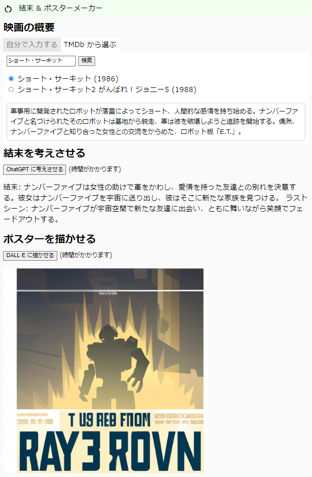

# 映画の結末とポスターを生成

## 概要

OpenAI の API を使った試験的なウェブアプリです。  
ストーリーの概要を入力して、以下を生成します。

- ストーリーの結末
- 映画のポスター

## 動くサンプル

こちらにデプロイして公開しています (メンテ中でアクセスできない場合があります)。

- [結末 & ポスターメーカー](https://satamame.ddns.me:5380/movie_chat)

## 動かし方

※今はデータベースは使っていないので、データベース関連の設定を削除しても構いません。

1. requirements.txt を使ってパッケージをインストールする。
2. データベースを準備する (データベースを使う場合)。
3. .env.dist を元に .env ファイルを作る。
    - 内容は環境に依存します。
    - .env ファイルを公開しないこと。
4. `makemigrations` と `migrate` をする (データベースを使う場合)。
5. superuser を作る (データベースを使う場合)。
6. ブラウザからアクセスできるようにする。
    - ローカル環境なら `runserver` する。
    - 公開する場合は環境に合わせてデプロイする。
